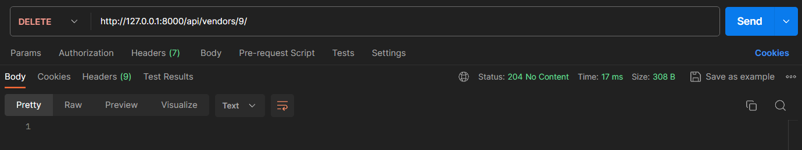

# Vendor-Management-System-using-Django-REST-Framework

### Introduction

This API helps in tracking Vendor profiles, Purchase Orders and Historical Performance of the Vendors using performance metrics like On Time Delivery Rate, Average Rating, Average Response Time and Fulfillment Rate to incorporate trend analysis of the vendor's performance.

---

### Installation

1. Clone the repository to your system
```bash
git clone https://github.com/vkay616/vendor-management-system-using-django-rest-framework.git 
```

2. Change to the directory that stores the local repository and install the required libraries
```bash
pip install -r requirements.txt
```

3. Change directory to head inside the the django project folder
```bash
cd vendor_mgmt_sys
```

4. Run the migration commands just in case any changes were made to the models.py file
```bash
python manage.py makemigrations
python manage.py migrate
```

5. Finally, start the server
```bash
python manage.py runserver
```

6. Now you can use cURL commands, any programming language or a tool like Postman to send various requests to the API and get appropriate responses. 


**I recommend using Postman since I've exported a collection of all API requests and provided it in the repository, using that you can easily test all the requests.** 


---

### API Documentation

#### Open Endpoint

Open endpoints require no authentication.

| Endpoint | Detail | Example |
| :---:        |     :---:      |          :---: |
| `GET /api/token/`   | returns the authorization token     |     |


#### Closed Endpoints

These are the endpoints that require a valid token in the header of the request.


**_Vendor Profile Management and Performance Tracking_**

| Endpoint | Detail | Example |
| :---:        |     :---:      |          :---: |
| `GET /api/vendors/`   | returns the list of all vendors and their details     |     |
| `GET /api/vendors/{vendor_id}/`   | returns the details of a specific vendor     |     |
| `POST /api/vendors/`   | creates a new vendor     |     |
| `PUT /api/vendors/{vendor_id}/`   | updates the specific vendor's details     |     |
| `DELETE /api/vendors/{vendor_id}/`   | deletes the vendor     |     |
| `GET /api/vendors/{vendor_id}/performance/`   | returns the vendor's recorded history of performance metrics     |     |


**_Purchase Orders Tracking_**

| Endpoint | Detail | Example |
| :---:        |     :---:      |          :---: |
| `GET /api/purchase_orders/`   | returns the list of all purchase orders     |     |
| `GET /api/purchase_orders/{order_id}/`   | returns the details of a purchase order by its order ID     |     |
| `GET /api/purchase_orders/?vendor={vendor_id}/`   | returns the details of all purchase orders associated with the vendor whose ID is provided in the query parameter     |     |
| `POST /api/purchase_orders/`   | creates a new purchase order     |     |
| `PUT /api/purchase_orders/{order_id}/`   | updates the specific order's details     |     |
| `DELETE /api/purchase_orders/{order_id}/`   | deletes the purchase order     |     |
| `POST /api/purchase_orders/{order_id}/acknowledge/`   | acknowledges the purchase order and sets the acknowledgment_date field of the order to the current date and time. Also, triggers the average_response_time metric calculation.     |  &nbsp;&nbsp;&nbsp;&nbsp;&nbsp;&nbsp;&nbsp;&nbsp;&nbsp;&nbsp;&nbsp;&nbsp;&nbsp;&nbsp;&nbsp;&nbsp;&nbsp;&nbsp;&nbsp;&nbsp;&nbsp;&nbsp;&nbsp;&nbsp;&nbsp;&nbsp;&nbsp;&nbsp;&nbsp;&nbsp;&nbsp;&nbsp;&nbsp;&nbsp;&nbsp;&nbsp;&nbsp;&nbsp;&nbsp;&nbsp;&nbsp;&nbsp;&nbsp;&nbsp;&nbsp;&nbsp;&nbsp;&nbsp;&nbsp;&nbsp;&nbsp;&nbsp;&nbsp;&nbsp;&nbsp;&nbsp;&nbsp;&nbsp;&nbsp;&nbsp;&nbsp;&nbsp;&nbsp;&nbsp;&nbsp;&nbsp;&nbsp;&nbsp;&nbsp;&nbsp;&nbsp;&nbsp;&nbsp;&nbsp;&nbsp;&nbsp;&nbsp;&nbsp;&nbsp;&nbsp;&nbsp;&nbsp;&nbsp;&nbsp;&nbsp;   |